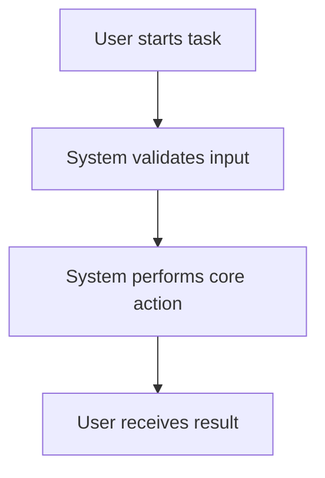
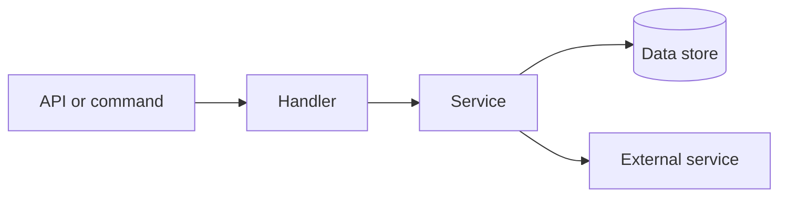
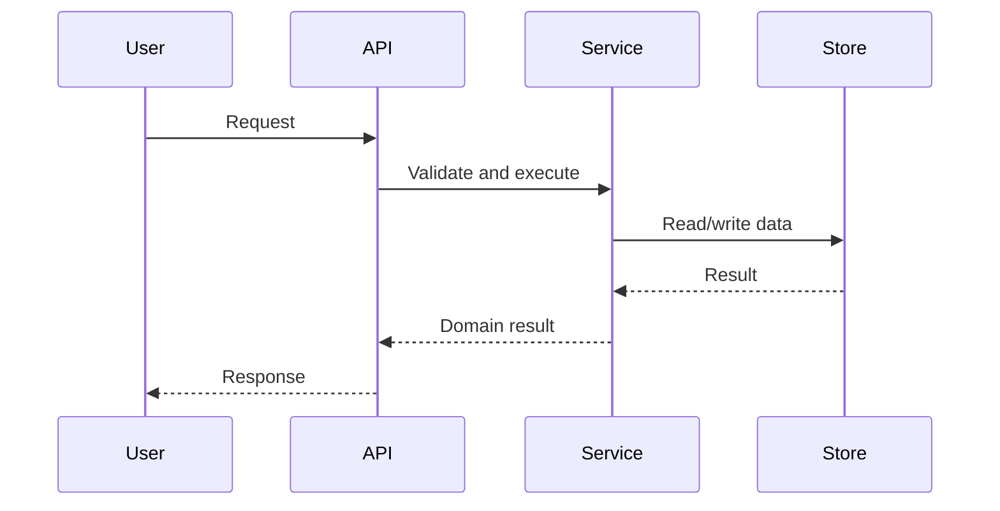

Use this skill to reverse-engineer a project into a requirements document that product, engineering, and QA can navigate.

Default to an HTML report with lightweight interactions. Produce Markdown only when the user asks for a text-first artifact, a PR-friendly source document, or an additional companion file.

User request:

```text
{{args}}
```

Honor any concrete user request above, such as output format, report path, focus area, API subset, diagram style, or language. If it is empty, generate the default HTML requirements report for the current workspace.

## Output

Create the primary report at:

```text
docs/requirements/{{date}}-project-requirements.html
```

If a companion Markdown file is useful, create:

```text
docs/requirements/{{date}}-project-requirements.md
```

The HTML should be self-contained: inline CSS, inline JavaScript, no build step, no required external assets.

When the target HTML file already exists and contains `REQUIREMENTS_*` marker sections, treat it as the canonical report shell. Edit those marker sections in place instead of replacing the whole file. Preserve the existing CSS, JavaScript, navigation, metadata, and surrounding structure unless the user explicitly asks to redesign the shell.

Diagrams must be visible when the HTML is opened directly from disk:

- Prefer inline SVG for architecture maps, dependency graphs, sequence summaries, and state diagrams.
- Use semantic SVG groups, `<title>`/`<desc>`, readable labels, arrow markers, and stable element ids so sections can link to diagram nodes.
- For simple hierarchy diagrams, CSS grid/flex boxes with connector lines are also acceptable.
- Do not rely on Mermaid rendering as the only visible diagram. Mermaid source may be included in a collapsible `<details>` block as an editable source-of-truth companion.
- Use Mermaid CDN rendering only as optional progressive enhancement when the user accepts network access. The static inline SVG or CSS diagram must remain the fallback and primary offline view.
- Avoid showing only raw Mermaid code blocks in the final HTML unless the user explicitly asks for source-only diagrams.

For medium or large projects, do not generate the entire HTML document in one model response or one huge `write` call. Create the report incrementally:

1. Write a complete HTML shell first: `doctype`, `<head>`, inline CSS, navigation container, empty main sections, inline script, and closing tags.
2. Add each major section with smaller `edit` insertions before a stable marker such as `<!-- REQUIREMENTS_SECTIONS -->`.
3. Keep each write/edit chunk focused: one section, one API group, or one diagram at a time.
4. After each chunk, preserve valid HTML and keep the marker in place until the final cleanup.
5. In the final pass, remove unused markers and verify the file can be opened directly from disk.

This chunked approach is required for HTML reports because inline CSS, JavaScript, diagrams, and API cards can become much larger than Markdown. It also gives the user immediate visible tool progress instead of waiting for one giant generated tool call.

## Process

1. Inspect the project before writing:
   - Read top-level docs such as `README.md`, `OPERATIONS.md`, `docs/`, and deployment notes.
   - Identify the stack from package manifests, route files, command handlers, API clients, database modules, schemas, and tests.
   - Search with `rg` for routes, handlers, controllers, commands, schemas, migrations, HTTP verbs, RPC methods, queue handlers, and CLI subcommands.
2. Build an evidence map:
   - `EXTRACTED`: behavior directly supported by source code, docs, tests, config, or schemas.
   - `INFERRED`: reasonable product requirement inferred from code relationships.
   - `UNKNOWN`: requirement, owner, actor, edge case, or business rule that needs user confirmation.
3. Decompose by API or interface first:
   - HTTP API endpoints.
   - CLI commands and subcommands.
   - Tool calls, MCP handlers, RPC methods, queue jobs, scheduled tasks, or exported SDK functions.
   - UI flows only after the backend/interface layer is mapped, unless the project is frontend-only.
4. Connect each API/interface to requirements:
   - User goal and actor.
   - Trigger and entry point.
   - Request/input shape.
   - Response/output shape.
   - Validation and permission rules.
   - Data read/write behavior.
   - Internal modules called.
   - External services or files touched.
   - Error cases and retry/rollback behavior.
   - Observability, audit, and security notes.
   - Acceptance criteria.
5. Generate diagrams:
   - Product flowchart for the main user journey.
   - API dependency graph linking endpoints/commands to modules, data stores, and external services.
   - Sequence diagram for at least one high-value flow.
   - State or lifecycle diagram when the domain has clear states.
   - Render each diagram as static inline SVG or CSS boxes in the HTML, with optional Mermaid source hidden in a collapsible details block.
6. Write the report and preserve traceability:
   - Link sections with stable anchors.
   - Include code file paths for evidence.
   - Mark inferred or unknown content visibly.
   - Avoid pretending uncertain requirements are confirmed.
   - For HTML output, write the shell first, then append/insert sections incrementally instead of producing one large complete file in a single tool call.

## HTML Structure

Use this structure unless the project suggests a better one:

1. Executive summary.
2. System map with a high-level static SVG or CSS architecture diagram.
3. API/interface inventory with filters or grouped navigation.
4. Per-API requirement cards.
5. Core user flows with diagrams.
6. Domain model and data ownership.
7. Permissions, security, and compliance notes.
8. Error handling and edge cases.
9. Non-functional requirements.
10. Open questions and `UNKNOWN` items.
11. Source evidence index.

## Interaction Guidelines

Implement useful interactions with plain JavaScript:

- Sticky table of contents.
- Search/filter input for APIs, modules, and tags.
- Expand/collapse details for each API.
- Anchor links for every API and flow.
- Evidence tags: `EXTRACTED`, `INFERRED`, `UNKNOWN`.
- Back-to-top links for long reports.
- Optional "show only open questions" toggle.

Keep interactions accessible:

- Use semantic headings, buttons, tables, and lists.
- Make controls keyboard reachable.
- Do not hide critical content behind JavaScript-only rendering.
- Ensure the document remains readable if JavaScript is disabled.

## API Section Template

For each API, command, handler, or externally visible interface, include:

```text
Name:
Type:
Route/command/function:
Evidence:
Actor:
Goal:
Inputs:
Outputs:
Preconditions:
Main flow:
Alternative flows:
Validation:
Permissions:
Data reads:
Data writes:
Internal dependencies:
External dependencies:
Errors:
Observability:
Acceptance criteria:
Open questions:
```

## Diagram Patterns

Use static diagrams when diagrams help compress complexity. In HTML output, render the visible diagram as inline SVG or CSS boxes. Include Mermaid only as optional source text when it helps future editing.

Inline SVG architecture map:

```html
<figure class="diagram" id="system-architecture">
  <figcaption>System architecture</figcaption>
  <svg viewBox="0 0 960 520" role="img" aria-labelledby="arch-title arch-desc">
    <title id="arch-title">System architecture</title>
    <desc id="arch-desc">CLI commands call runtime services, which use tools and data stores.</desc>
    <defs>
      <marker id="arrow" markerWidth="10" markerHeight="10" refX="8" refY="3" orient="auto">
        <path d="M0,0 L0,6 L9,3 z"></path>
      </marker>
    </defs>
    <g id="cli-layer">
      <rect x="40" y="40" width="220" height="90" rx="8"></rect>
      <text x="60" y="90">CLI Entry</text>
    </g>
    <g id="runtime-layer">
      <rect x="370" y="40" width="240" height="90" rx="8"></rect>
      <text x="390" y="90">Runtime</text>
    </g>
    <line x1="260" y1="85" x2="370" y2="85" marker-end="url(#arrow)"></line>
  </svg>
</figure>
```

CSS box architecture map:

```html
<section class="arch-map" aria-label="System architecture">
  <a class="arch-node" href="#api-chat">Chat command</a>
  <span class="arch-edge" aria-hidden="true">-></span>
  <a class="arch-node" href="#runtime-agent-loop">Agent loop</a>
  <span class="arch-edge" aria-hidden="true">-></span>
  <a class="arch-node" href="#tools-write">Tools</a>
</section>
```

Optional Mermaid companion:

Product flow:



API dependency map:



Sequence flow:



## Quality Bar

The report is complete when:

- A reader can find every major API or user-facing interface from the navigation.
- Each interface has at least one source evidence path.
- Main flows and dependencies are represented both in text and diagrams.
- Inferred requirements are labeled instead of stated as facts.
- Open questions are grouped so the user can resolve them later.
- The HTML can be opened directly from disk in a browser.
