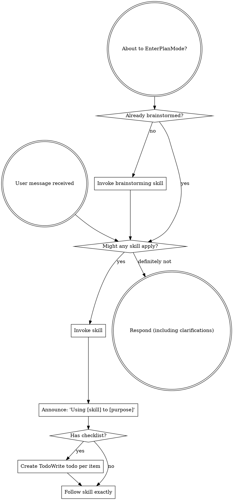

<SUBAGENT-STOP>
If you were dispatched as a subagent to execute a specific task, skip this skill.
</SUBAGENT-STOP>

<EXTREMELY-IMPORTANT>
If a skill clearly applies to the task, invoke it before acting. Skills are current workflow instructions, not background reading.
</EXTREMELY-IMPORTANT>

## Instruction Priority

Codemini skills guide workflow, but **user instructions always take precedence**:

1. **User's explicit instructions** (`AGENTS.md`, direct requests, project docs) - highest priority
2. **Codemini skills** - workflow guidance for the current task
3. **Default system prompt** - baseline behavior

If `AGENTS.md` says "do not use TDD" and a skill says to use TDD, follow `AGENTS.md`. The user is in control.

## How to Access Skills

Use Codemini's `skill` tool for indexed skills, or invoke a skill as a slash command such as `/systematic-debugging`. The full `SKILL.md` is loaded on demand; do not read skill files manually unless you are editing the skill itself.

# Using Skills

Codemini ships a compact built-in skill set focused on day-to-day development:

| Skill | Use when |
| --- | --- |
| `brainstorming` | Requirements or approach are still ambiguous. |
| `test-driven-development` | Implementing a feature or bugfix with meaningful behavior. |
| `systematic-debugging` | Investigating a bug, failing test, or unexpected behavior. |
| `verification-before-completion` | Before claiming work is complete or fixed. |
| `requesting-code-review` | Before merging or when a plan/change needs pressure testing. |
| `receiving-code-review` | When acting on review feedback. |
| `using-git-worktrees` | When isolated feature work would reduce risk. |
| `project-requirements` | When explicitly generating a project requirements / CodeWiki report. |

## The Rule

**Invoke relevant or requested skills before taking action.** If a skill may apply, load it with Codemini's `skill` tool or invoke it as a slash command, then follow the current instructions from that skill. If it turns out not to fit, say so briefly and continue with the better workflow.

## Red Flags

These thoughts mean STOP—you're rationalizing:

| Thought | Reality |
|---------|---------|
| "This is just a simple question" | Questions are tasks. Check for skills. |
| "I need more context first" | Skill check comes BEFORE clarifying questions. |
| "Let me explore the codebase first" | Skills tell you HOW to explore. Check first. |
| "I can check git/files quickly" | Files lack conversation context. Check for skills. |
| "Let me gather information first" | Skills tell you HOW to gather information. |
| "This doesn't need a formal skill" | If a skill exists, use it. |
| "I remember this skill" | Skills evolve. Read current version. |
| "This doesn't count as a task" | Action = task. Check for skills. |
| "The skill is overkill" | Simple things become complex. Use it. |
| "I'll just do this one thing first" | Check BEFORE doing anything. |
| "This feels productive" | Undisciplined action wastes time. Skills prevent this. |
| "I know what that means" | Knowing the concept ≠ using the skill. Invoke it. |

## Skill Priority

When multiple skills could apply, use this order:

1. **Process skills first** (brainstorming, debugging) - these determine HOW to approach the task
2. **Implementation skills second** (frontend-design, mcp-builder) - these guide execution

"Let's build X" → brainstorming first, then implementation skills.
"Fix this bug" → debugging first, then domain-specific skills.

## Skill Types

**Rigid** (TDD, debugging): Follow exactly. Don't adapt away discipline.

**Flexible** (patterns): Adapt principles to context.

The skill itself tells you which.

## User Instructions

Instructions say WHAT, not HOW. "Add X" or "Fix Y" doesn't mean skip workflows.
